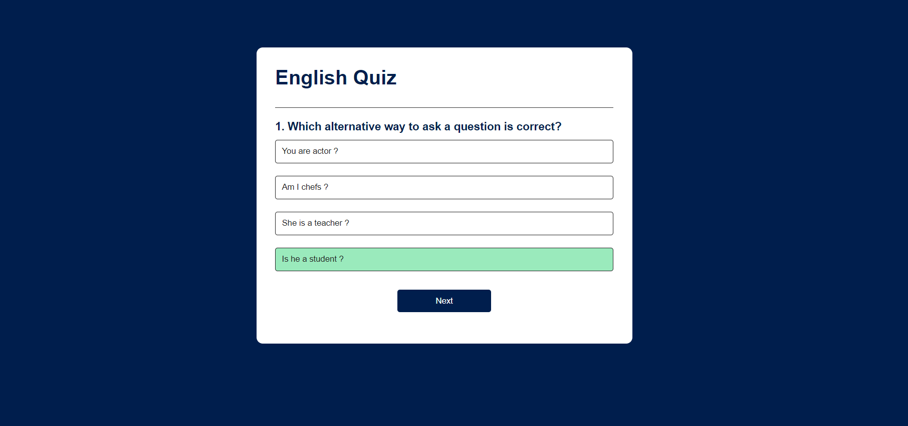

# Quiz Game:

Criei um quiz em inglês usando HTML, CSS e JavaScript. O quiz tem 5 perguntas com opções de resposta, fornecendo feedback imediato. Ao final, exibe a pontuação total, proporcionando uma experiência interativa e educativa. O design é responsivo para diferentes dispositivos. O projeto visa testar e melhorar os conhecimentos em inglês de forma divertida.

# Experimente o Quiz Game:

https://amandamoreirainfo.github.io/quiz-game/

# Capturas de Telas:

